# Git and GitHub GDSC

## How to install Git

In order to use Git, you have to install it on your computer. To do this, you can download the latest version on the official [website](https://git-scm.com/downloads) . You can download for your operating system from the options given.

You can also install Git using the command line, but since the commands vary with each operating system, we'll focus on the more general approach.

## How to configure Git

I will assume that at this point you have installed Git. To verify this, you can run this command on the command line: git --version. This shows you the current version installed on you PC.

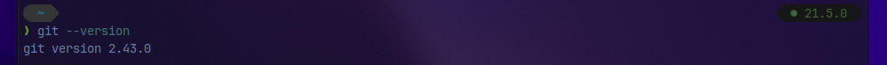

The next thing you'll need to do is to set your username and email address. Git will use this information to identify who made specific changes to files.

To set your username, type and execute these commands: `git config --global user.name "YOUR_USERNAME"` and `git config --global user.email "YOUR_EMAIL"`. Just make sure to replace "YOUR_USERNAME" and "YOUR_EMAIL" with the values you have setup in GitHub as the name suggests.

## How to Create and Initialize a Project in Git

We are finally done with installing and setting up Git. It is now time to create our project.

I have created a folder on my desktop called Git and GitHub tutorial. Using the command line, navigate to your new project's location. For me, I would run the following commands:

`cd desktop`

`cd Git-and-GitHub-Tutorial`

If you are new to the command line and are still learning how to use it to navigate around your PC, then I would suggest learning some basic commands of linux which will be universal for every systems using the bash shell(don't worry what this is, just remember the name) such as `cd` for change directory, `ls` to list files.

Now to initialize your project, simply run git init. This will tell Git to get ready to start watching your files for every change that occurs. It looks like this:

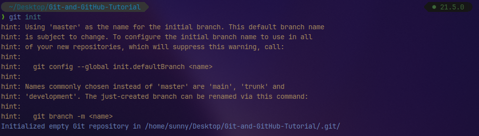

## How to push a repository to GitHub

I will divide this section into steps to help you understand the process more clearly.

### Step 1 – Create a GitHub account

To be able to use GitHub, you will have to create an account first. You can do that on their website. I hope you have already done that

### Step 2 – Create a repository

You can click on the + symbol on the top right corner of the page then choose "New repository". Give your repo a name then scroll down and click on "Create repository".

### Step 3 – Add and commit file(s)

Before we "add" and "commit" our files, you need to understand the stages of a file being tracked by Git.

- Committed state

A file is in the committed state when all the changes made to the file have been saved in the local repo. Files in the committed stage are files ready to be pushed to the remote repo (on GitHub).

- Modified state

A file in the modified state has some changes made to it but it's not yet saved. This means that the state of the file has been altered from its previous state in the committed state.

- Staged state

A file in the staged state means it is ready to be committed. In this state, all necessary changes have been made so the next step is to move the file to the commit state.

You can understand this better by imagining Git as a camera. The camera will only take a snapshot when the file reaches the commit state. After this state, the camera starts comparing changes being made to the same file with the last snapshot (this is the modified state). And when the required changes have been made, the file is staged and moved to the commit state for a new snapshot.

This might be a lot of information to take in at the moment, but do not be discouraged – it gets easier with practice.

## How to add files in Git

When we first initialized our project, the file was not being tracked by Git. To do that, we use this command `git add . ` The period or dot that comes after add means all the files that exist in the repository. If you want to add a specific file, maybe one named about.txt, you use `git add about.txt` then give a space then another `filename.txt` and so on.

Now our file is in the staged state. You will not get a response after this command, but to know what state your file is in, you can run the `git status` command, which shows us this:

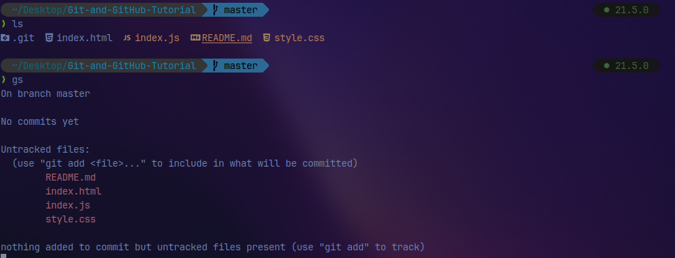

## How to commit files in Git

The next state for a file after the staged state is the committed state. To commit our file, we use the `git commit -m "message_to_send"` command. The message can be anything meaningful that you want to show to the people working in the repository.

The first part of the command `git commit` tells Git that all the files staged are ready to be committed so it is time to take a snapshot. The second part `-m "first commit"` is the commit message. `-m` is shorthand for message while the text inside the parenthesis is the commit message.

After executing this command, you should get a response similar to this:

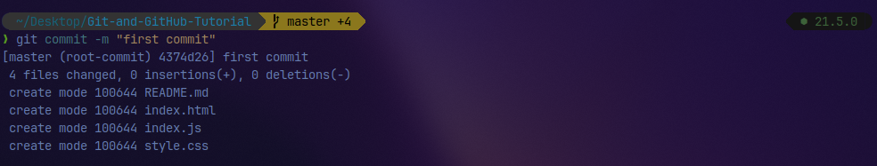
Now our file is in the committed state.

### Step 4 – Push the repository to GitHub

After you create the repo, you should be redirected to a page that tells you how to create a repo locally or push an existing one.

In our case, the project already exists locally so we will use commands in the "…or push an existing repository from the command line" section. These are the commands:

```
git remote add origin https://github.com/LegioN2004/git-and-github-GDSC.git
git branch -M main
git push -u origin main
```

The first command `git remote add origin https://github.com/ihechikara/git-and-github-tutorial.git` creates a connection between your local repo and the remote repo on Github.

The URL for your remote project should be entirely different from the one above. So to follow along, make sure you are following the steps and working with your own remote repo. You won't usually get a response after executing this command but make sure you have an internet connection.

The second command `git branch -M main` changes your main branch's name to "main", more on the branch part later on. The default branch might be created as "master", but "main" is the standard name for this repo now. There is usually no response here.

The last command `git push -u origin main` pushes your repo from your local device to GitHub. You should get a response similar to this:

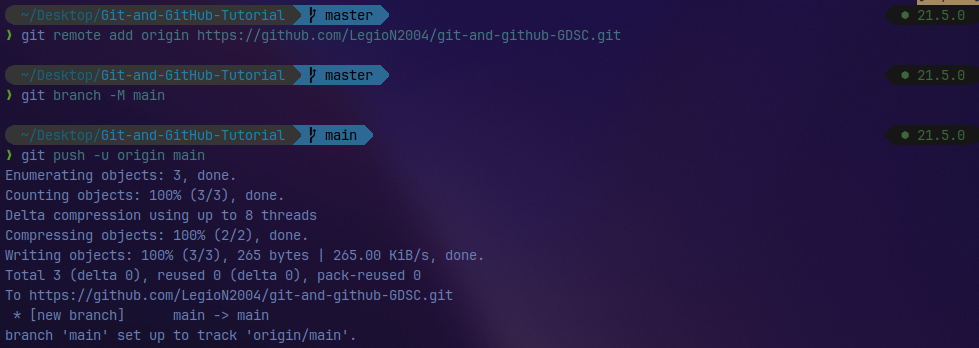

To help you deepen your understanding of file stages, I will make changes to the file and then push the new version to GitHub.

Recall that our file is now in the committed state. Let's make changes to the file and take note of the states.

I am going to make some changes to the files

After making changes to any of the files that have been commited and pushed to the git running the `git status` will show what has happened to them, in our case modified and this is what you should see

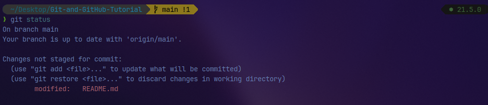

After making changes to the file, it moved to the modified state – but it's not yet staged for commit, so you can't push it to GitHub yet. Git has not taken a final snapshot of this current state as it's only comparing the changes we have made now with the last snapshot.

Now we are going to add (stage) this file and then commit and push it. This is the same as in the last section.

We first add the file by using `git add .` which adds all the files in the folder (one modified file in our case). Then we commit the file by running `git commit -m "modified one file"` followed by `git push -u origin main`.

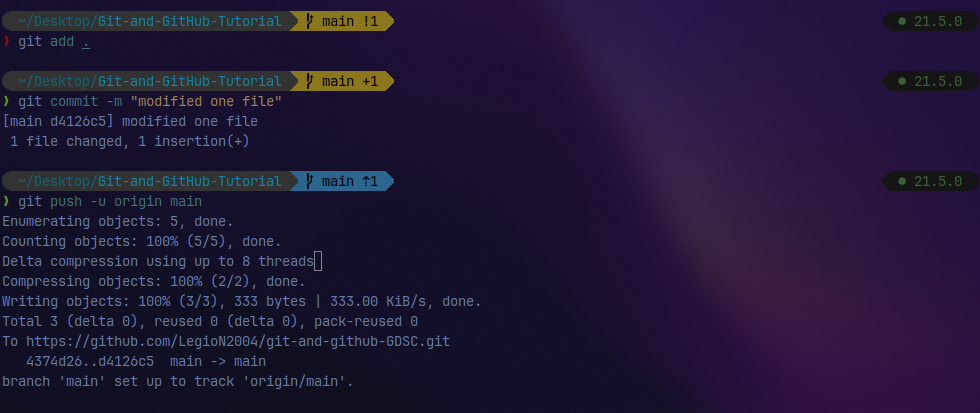

Those are the three steps to pushing your modified files to GitHub. You add, commit, and then push. I hope you now understand file stages and the commands associated with them.

## How to Use Branches in Git

With branches, you can create a copy of a file you would like to work on without messing up the original copy. You can either merge these changes to the original copy or just let the branch remain independent.

Before we go into using branches, I want to show you a visual representation of our repo which looks like this:

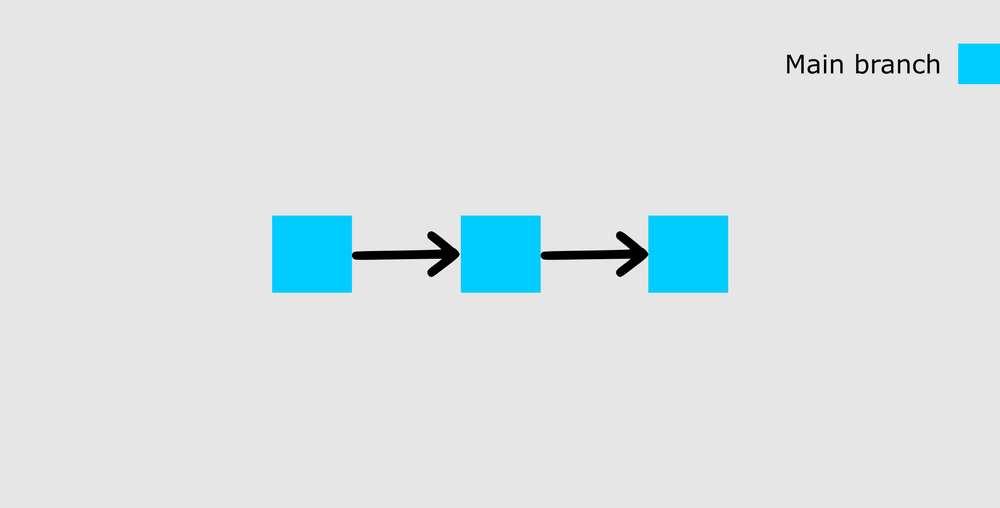
The image above shows our main branch with the last two commits (the first commit and the added new task commit).

At this point, I want to add more tasks to the list but I am not yet sure whether I want them on my main list. So I will create a new branch called 'test' to see what my list would look like with more tasks included.

To create a new branch, run this command: `git checkout -b test`. I will break it down.

`checkout` tells Git it is supposed to switch to a new branch. `-b` tells Git to create a new branch. `test` is the name of the branch to be created and switched to. Here is the response you should get:

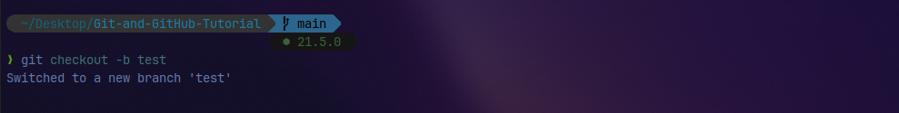

Now that we have a new branch created, this is what our repo will look like:

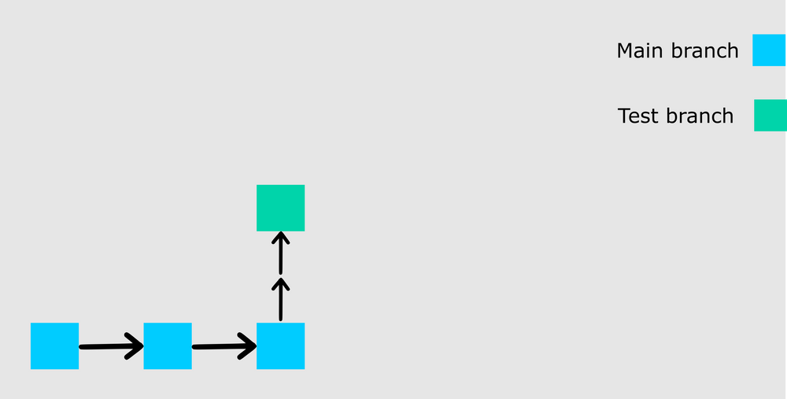

We created the new branch from the state of our last commit. Let's now add more changes to this new branch.

    I have added some new stuff. To merge the new state to the main branch, you have to first stage and commit this branch. I will not go into details about how to do this as we did it twice in the last section.

You should try doing it yourself so you understand how it works. As a hint, add the file and then commit with a message (refer to the previous section for details showing you how to do that).

After committing your test branch, switch back to the main branch by running this command: `git checkout main`.

Did you notice that we did not add `-b` ? This is because we are not creating a new branch but rather switching to an existing one. You can check all the branches that exist in your repo by running the `git branch` command.

Now we can merge the changes we made in the test branch into the main branch by running `git merge test`. At this point, you will see all the changes made in the test branch reflected on the main branch. You should also receive a response similar to this:

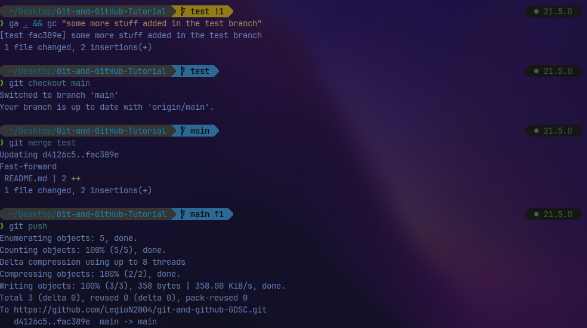

Here is a visual representation of our repo:

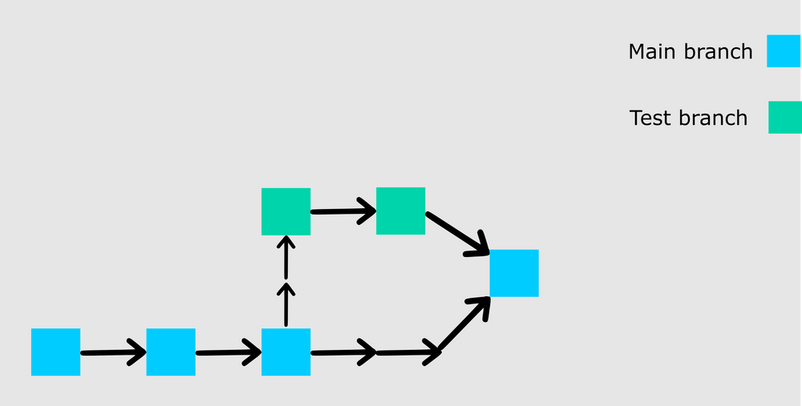

If you go on to push your repo to GitHub, you'll see that the test branch will not be pushed. It will only remain in your local repo. If you would like to push your test branch, switch to the branch using `git checkout test` and then run ` git push -u origin test`.

## How to Pull a Repository in Git

To pull in Git means to clone a remote repository's current state into your computer/repository. This comes in handy when you want to work on your repo from a different computer or when you are contributing to an open source project online.

To test this, don't worry about switching to a new computer. Just run `cd ..` to leave the current directory and go back one step. In my own case, I have navigated back to my desktop.

Go to GitHub, and on your repository's main page you should see a green button that says "Code". When you click on the button, you should see some options in a dropdown menu. Go on and copy the HTTPS URL.

After that, run `git clone YOUR_HTTPS_URL`. This command pulls the remote repository into your local computer in a folder called git-and-git-tutorial. That is:

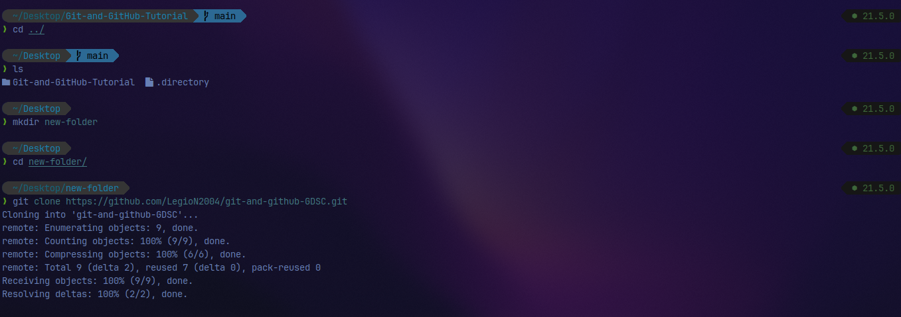

- litte side note on the commands ran here
  - `cd`: changes directory, using `..` or `../` goes to the previous directory and if you do `../../` goes back two previous directory and so on
  - `mkdir`: creates a directory: I created a directory here because you cannot put two same directory in the same place. By pulling one from the github, it has the same name and as such I cannot put it there.
  - So I created one directory called new-folder and `cd`ed into it and then cloned it locally

## Conclusion

This article covered the basic commands that'll help get you started using Git. We also started learning how to use GitHub.

If you have followed up to this point then congratulations, you are good to go. You can now use Git in your projects no matter what programming language you are using.
